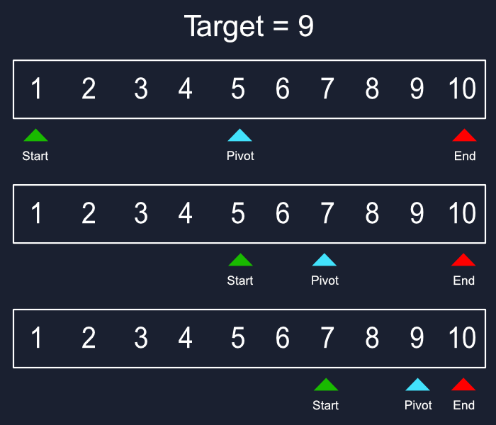

# Binary Search: Beyond the Basics

> Binary search is more than `while (lo <= hi)`: advanced mastery enables clean solutions to complex search problems, minimizes off-by-one headaches, and opens doors to specialized optimizations.



---

## TL;DR

Binary search solves ordered search in `O(log n)`, but in production you'll rarely just look for "the element equal to target." You’ll **search predicates**, **find boundaries**, **work with floats**, and **adapt to performance constraints**.

---

## Classic Template

```js
function binarySearch(arr, target) {
  let lo = 0, hi = arr.length - 1;
  while (lo <= hi) {
    const mid = lo + ((hi - lo) >> 1); // avoid overflow
    if (arr[mid] === target) return mid;
    if (arr[mid] < target) lo = mid + 1;
    else hi = mid - 1;
  }
  return -1;
}
````

### Python Variant

```python
def binary_search(a, target):
    lo, hi = 0, len(a) - 1
    while lo <= hi:
        mid = lo + (hi - lo) // 2
        if a[mid] == target:
            return mid
        if a[mid] < target:
            lo = mid + 1
        else:
            hi = mid - 1
    return -1
```

---

## Pattern: First True in Predicate

We generalize: given a monotonic boolean function `f(i)`, find smallest `i` where `f(i)` is true.

```ts
function firstTrue(n: number, f: (i:number)=>boolean) {
  let lo = 0, hi = n; // hi exclusive
  while (lo < hi) {
    const mid = (lo + hi) >> 1;
    if (f(mid)) hi = mid;
    else lo = mid + 1;
  }
  return lo; // possibly n if none
}
```

> **TIP:** Use half-open interval `[lo, hi)` to make termination reasoning simpler.

---

## Pattern: Last True

Last index where `f(i)` is true.

```ts
function lastTrue(n: number, f: (i:number)=>boolean) {
  let lo = 0, hi = n; // hi exclusive
  while (lo < hi) {
    const mid = ((lo + hi + 1) >> 1);
    if (f(mid)) lo = mid;
    else hi = mid - 1;
  }
  return lo;
}
```

---

## Lower vs Upper Bound

| Variant      | Return           | Invariant | Loop Condition |
| ------------ | ---------------- | --------- | -------------- |
| lower\_bound | first index >= x | \[lo, hi) | lo < hi        |
| upper\_bound | first index >  x | \[lo, hi) | lo < hi        |

```cpp
int lower_bound(const vector<int>& a, int x){
  int lo=0, hi=a.size();
  while(lo<hi){
    int mid=(lo+hi)/2;
    if(a[mid] < x) lo=mid+1;
    else hi=mid;
  }
  return lo;
}
```

---

## Floating Point Binary Search

When searching for real values:

```python
def binary_search_float(lo, hi, f, eps=1e-9):
    while hi - lo > eps:
        mid = (lo + hi) / 2
        if f(mid):
            hi = mid
        else:
            lo = mid
    return lo
```

> **Example:** Finding the square root of a number without using built-ins.

---

## Common Pitfalls

* **Overflow**: In 32-bit integer contexts, use `mid = lo + (hi - lo) / 2`.
* **Mixing interval types**: Don’t mix `[lo, hi]` and `[lo, hi)` logic mid-function.
* **Infinite loops**: Always ensure the interval shrinks.
* **Empty array edge case**: Return sentinel value immediately.
* **Predicate assumption**: `f(i)` must be **monotonic** for the pattern to work.

---

## Performance Optimizations

1. **Branchless Binary Search**
   Avoid unpredictable branches for better CPU pipeline usage.
2. **Unrolled Steps for Small Arrays**
   Fall back to linear scan when size < threshold.
3. **Pre-Sorting with Hints**
   Use galloping search if the next search target is likely near the last.
4. **SIMD Assisted Searches**
   Use vectorized instructions when array fits in registers.

---

## Beyond Arrays

Binary search works on **any monotonic search space**:

* **On the answer space**: e.g., "minimum time to complete X tasks."
* **On continuous ranges**: e.g., binary searching over double precision.
* **On implicit arrays**: e.g., infinite sequences, file offsets.
* **On functions**: e.g., root finding for monotonic functions.

---

## Real-World Applications

* **Scheduling**: Find earliest available slot in sorted calendar.
* **Version Control**: `git bisect` to find first bad commit.
* **Gaming**: Find minimal difficulty to beat an AI in <= N moves.
* **Manufacturing**: Optimize machine feed rates while maintaining tolerance.
* **Finance**: Determine smallest investment needed to cross a threshold.

---

## Complexity

| Operation      | Time                | Space |
| -------------- | ------------------- | ----- |
| Search / Bound | O(log n)            | O(1)  |
| Floating Point | O(log((hi-lo)/eps)) | O(1)  |

---

## Practice Task List

* [x] Basic search
* [x] First true
* [x] Last true
* [x] Lower bound / Upper bound
* [ ] Floating point answer search (tolerance based)
* [ ] Galloping + binary hybrid
* [ ] Branchless variant
* [ ] Apply on implicit array (API call)

---

## Conclusion

Binary search is a **meta-tool**: once you understand the invariant & termination condition, you can adapt it to almost any ordered search problem—array or not.

---

## Next Steps

✅ In the next update, we’ll add **visual diagrams** for the "first true" and "last true" patterns to make them intuitive for new readers while retaining advanced depth.
